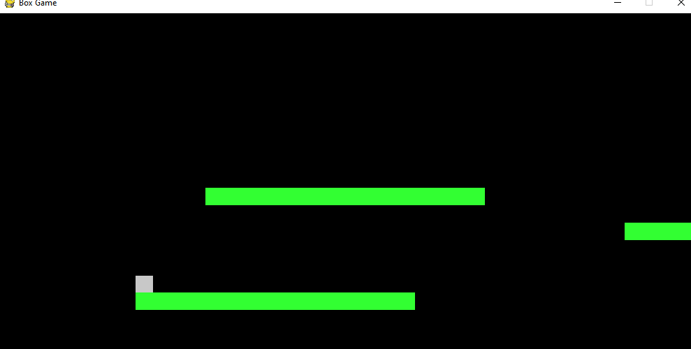

# Box Jump Game
Simple Python game using PyGame. This projects purpose was to learn how to use pygame.
Will infinitely generate platforms at random heights and between a range of lengths till the player falls.

